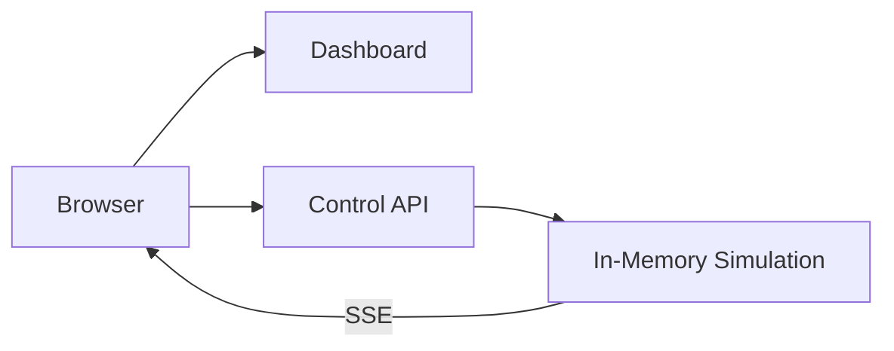
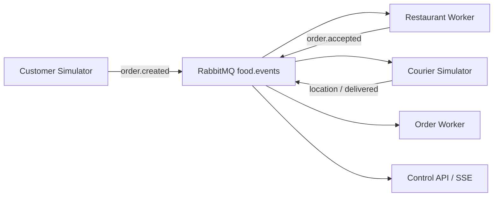
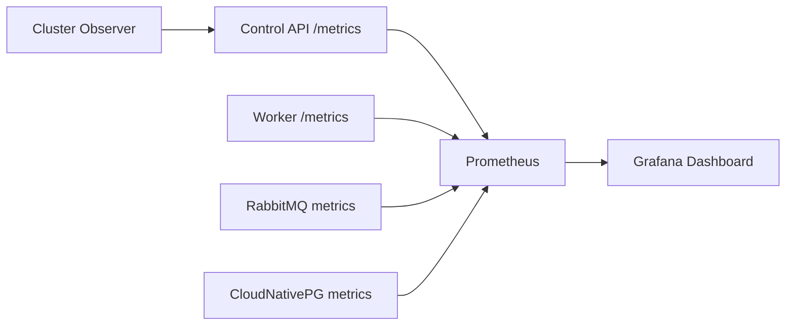

# Architektur

## Block 3: Standalone

Das Dashboard und die Control API laufen als getrennte Deployments. Die Control API besitzt vorerst den In-Memory-Zustand und führt die Simulation aus.

Die bewusste Einschränkung ist sichtbar: `control-api` darf noch nicht horizontal skaliert werden. Mehrere Replicas hätten voneinander abweichende Zustände. Messaging und Persistenz lösen dies in späteren Blöcken.

## Block 4: Ingress und Load Balancing

Traefik veröffentlicht Dashboard und API unter einem gemeinsamen Einstiegspunkt:

- `/` wird zum `dashboard`-Service geroutet.
- `/api`, `/health` und `/metrics` werden zum `control-api`-Service geroutet.
- Zwei Dashboard-Pods zeigen das Load Balancing des Services.
- Die Control API bleibt wegen des In-Memory-Zustands bei einer Replica.

## Block 5: Messaging

RabbitMQ entkoppelt die fachliche Verarbeitung:

Die Verarbeitung ist at-least-once. Der Order Worker besitzt in diesem Block nur einen lokalen Idempotenzspeicher. Ein Pod-Neustart zeigt deshalb bewusst die noch offene Persistenzlücke.

## Block 6: CloudNativePG und Persistenz

Der Order Worker ist der einzige Schreiber des fachlichen Zustands. Er verarbeitet jedes Event mit einer PostgreSQL-Transaktion:

1. `event_id` in `processed_events` beanspruchen.
2. Fachliche Zustandsänderung projizieren.
3. Relevantes Event in `order_events` ablegen.
4. Transaktion committen und erst danach die RabbitMQ-Nachricht bestätigen.

Die Anwendungen verwenden den von CloudNativePG verwalteten `food-delivery-db-rw`-Service. Dieser zeigt nach einem Failover automatisch auf den neuen Primary.

## Block 7: Observability und Autoscaling

Prometheus sammelt Metriken aus den Services und aus der Persistenzschicht. Die Anwendungen stellen ihre Metriken über `/metrics` bereit. `ServiceMonitor`- und `PodMonitor`-Ressourcen beschreiben, welche Endpunkte Prometheus überwacht. Grafana visualisiert die gesammelten Werte in einem projektspezifischen Dashboard.

Der `cluster-observer` liest den Zustand der Pods, Services, Deployments, Ingress-Ressourcen und des CloudNativePG-Clusters über eine eingeschränkte Kubernetes-Rolle aus. Die Control API kann diesen Betriebszustand zusammen mit der Simulation an das Dashboard weitergeben.

Zusätzlich weist das HPA-Lab die automatische Skalierung nach. Der `HorizontalPodAutoscaler` skaliert das Deployment `lab-web` im Namespace `betrieb-lab` abhängig von der CPU-Auslastung:

- mindestens 2 Replicas
- höchstens 4 Replicas
- Zielwert: 50 Prozent durchschnittliche CPU-Auslastung
- Stabilisierung beim Herunterskalieren: 60 Sekunden

Unter Last werden zusätzliche Pods gestartet. Nach Ende des Lasttests reduziert der HPA die Replica-Anzahl wieder, sobald die Stabilisierung abgelaufen ist. Die Konfiguration befindet sich in `labs/block-07/hpa.yaml`; der Lasttest ist in `labs/block-07/load.sh` und `labs/block-07/load.ps1` dokumentiert.
